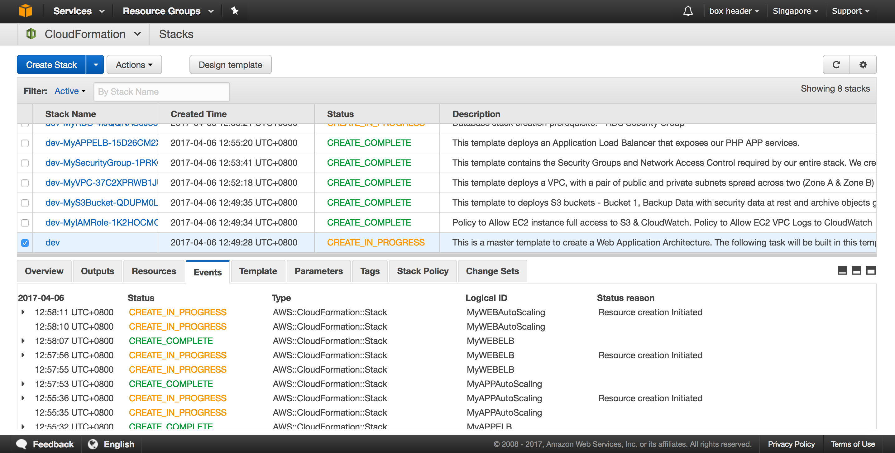

# Deploying Multi-AZ and Self-Healing Atlassian Jira with Docker

This reference architecture provides a set of YAML templates for deploying the following AWS services :
- Amazon IAM
- Amazon S3
- Amazon VPC
- Amazon Security Group & NACL
- Amazon RDS
- Amazon ELB
- Amazon AutoScaling
- Amazon Route53

## Prerequisites Notes
The Cloudformation Security Group IP address is open by default (testing purpose). You should update the Security Group Access with your own IP Address to ensure your instances security.

Before you can deploy this process, you need the following:
 - Your AWS account must have one VPC available to be created in the selected region
 - Amazon EC2 key pair
 - Installed Domain in Route 53.
 - Installed Certificate (in your selected region & also one in us-east-1) 

## Tested on the following Region:
 - US East (N. Virginia)


The repository consists of a set of nested templates that deploy the following:

 - A tiered [VPC](http://docs.aws.amazon.com/AmazonVPC/latest/UserGuide/VPC_Introduction.html) with public and private subnets, spanning an AWS region.
 - A self-healing arc deployed across multi [Availability Zones](http://docs.aws.amazon.com/AWSEC2/latest/UserGuide/using-regions-availability-zones.html) in an [Auto Scaling](https://aws.amazon.com/autoscaling/) group.
 - Two [NAT gateways](http://docs.aws.amazon.com/AmazonVPC/latest/UserGuide/vpc-nat-gateway.html) to handle outbound traffic.
 - An [Elastic Load Balancer (ELB)](https://aws.amazon.com/elasticloadbalancing/applicationloadbalancer/) to the public subnets to handle inbound traffic.

## Why use AWS CloudFormation with Amazon ECS?

Using CloudFormation to deploy and manage services with ECS has a number of nice benefits over more traditional methods ([AWS CLI](https://aws.amazon.com/cli), scripting, etc.). 

#### Infrastructure-as-Code

A template can be used repeatedly to create identical copies of the same stack (or to use as a foundation to start a new stack).  Templates are simple YAML- or JSON-formatted text files that can be placed under your normal source control mechanisms, stored in private or public locations such as Amazon S3, and exchanged via email. With CloudFormation, you can see exactly which AWS resources make up a stack. You retain full control and have the ability to modify any of the AWS resources created as part of a stack. 

#### Self-documenting 

Fed up with outdated documentation on your infrastructure or environments? Still keep manual documentation of IP ranges, security group rules, etc.?

With CloudFormation, your template becomes your documentation. Want to see exactly what you have deployed? Just look at your template. If you keep it in source control, then you can also look back at exactly which changes were made and by whom.

#### Intelligent updating & rollback

CloudFormation not only handles the initial deployment of your infrastructure and environments, but it can also manage the whole lifecycle, including future updates. During updates, you have fine-grained control and visibility over how changes are applied, using functionality such as [change sets](https://aws.amazon.com/blogs/aws/new-change-sets-for-aws-cloudformation/), [rolling update policies](http://docs.aws.amazon.com/AWSCloudFormation/latest/UserGuide/aws-attribute-updatepolicy.html) and [stack policies](http://docs.aws.amazon.com/AWSCloudFormation/latest/UserGuide/protect-stack-resources.html).

## Template details

The templates below are included in this repository and reference architecture:

| Template | Description |
| --- | --- | 
| [master.yaml](master.yaml) | This is the master template - deploy it to CloudFormation and it includes all of the nested templates automatically. |
| [infrastructure/atlassian-iam.yaml](infrastructure/atlassian-iam.yaml) | This template deploys will create policy to allow EC2 instance full access to S3 & CloudWatch, and VPC Logs to CloudWatch. |
| [infrastructure/atlassian-s3bucket.yaml](infrastructure/atlassian-s3bucket.yaml) | This template deploys Backup Data Bucket with security data at rest and archive objects greater than 60 days, and ELB logging. |
| [infrastructure/atlassian-vpc.yaml](infrastructure/atlassian-vpc.yaml) | This template deploys a VPC with a pair of public and private subnets spread across two Availability Zones. It deploys an [Internet gateway](http://docs.aws.amazon.com/AmazonVPC/latest/UserGuide/VPC_Internet_Gateway.html), with a default route on the public subnets. It deploys 2 [NAT gateways](http://docs.aws.amazon.com/AmazonVPC/latest/UserGuide/vpc-nat-comparison.html), and default routes for them in the private subnets. |
| [infrastructure/atlassian-securitygroup.yaml](infrastructure/atlassian-securitygroup.yaml) | This template contains the [security groups](http://docs.aws.amazon.com/AmazonVPC/latest/UserGuide/VPC_SecurityGroups.html) and [Network ACLs](http://docs.aws.amazon.com/AmazonVPC/latest/UserGuide/VPC_ACLs.html) required by the entire stack. |
| [infrastructure/atlassian-rds.yaml](infrastructure/atlassian-rds.yaml) | This template deploys a (Mysql) Relational Database Service. |
| [infrastructure/atlassian-elb.yaml](infrastructure/atlassian-elb.yaml) | This template deploys a Elastic Load Balancer that exposes http and https. |
| [infrastructure/atlassian-autoscaling-jira.yaml](infrastructure/atlassian-autoscaling-jira.yaml) | This template deploys an Jira Docker to the private subnets using an Auto Scaling group. |
| [infrastructure/atlassian-route53.yaml](infrastructure/atlassian-route53.yaml) | This template deploys Route 53 recordset to update ELB Alias. |

After the CloudFormation templates have been deployed, the [stack outputs](http://docs.aws.amazon.com/AWSCloudFormation/latest/UserGuide/outputs-section-structure.html) contain a link to the site URLs.



## How do I...?

### Get started and deploy this into my AWS account

You can launch this CloudFormation stack in your account:

Example using AWS CLI Command :

1. First Download this code into your workstation, make your own changes and make the prerequisites updates.
 - Your AWS account must have one VPC available to be created in the selected region.
 - Create Amazon EC2 key pair
 - Install a domain in Route 53.
 - Install a certificate (in your selected region & also one in us-east-1) 

2. Next install [AWS CLI](aws.amazon.com/cli) in your workstation.

3. Upload the files in the "infrastructure" directory into to your own S3 bucket.
 - Eg. aws s3 cp --recursive infrastructure/ s3://cf-templates-19sg5y0d6d084-ap-southeast-1/

4. You can run the master.yaml file from your workstation.


```
Example Setup:

Stage1 (~ 25 - 35 minutes)
===========================
To create a environment :
aws cloudformation create-stack \
--stack-name <env> \
--capabilities=CAPABILITY_IAM \
--template-body file:////path_to_template//cloudformation-jira//master.yaml

To update a environment :
aws cloudformation update-stack \
--stack-name <env> \
--capabilities=CAPABILITY_IAM \
--template-body file:////path_to_template//cloudformation-jira//master.yaml

To delete a environment :
aws cloudformation delete-stack --stack-name <env>

<env> - Note :stack-name that can be used are (dev, staging, prod)

Example :
aws cloudformation create-stack \
--stack-name dev \
--capabilities=CAPABILITY_IAM \
--parameters ParameterKey=DomainJiraPrefix,ParameterValue=dev-jira.crytera.com \
--parameters ParameterKey=DomainRdsPrefix,ParameterValue=dev-rds.crytera.com \
--parameters ParameterKey=InstanceType,ParameterValue=t2.medium \
--parameters ParameterKey=PMDatabasePassword,ParameterValue=xxxxxxx \
--parameters ParameterKey=PMDatabaseUsername,ParameterValue=jirastartadmin \
--parameters ParameterKey=PMHostedZone,ParameterValue=crytera.com \
--parameters ParameterKey=PMKeyName_NV,ParameterValue=mykey_nv \
--parameters ParameterKey=PMOWNIP,ParameterValue=192.xx.xx.xx/32 \
--parameters ParameterKey=PMPrivateSubnet1CIDR,ParameterValue=10.0.3.0/24 \
--parameters ParameterKey=PMPrivateSubnet2CIDR,ParameterValue=10.0.4.0/24 \
--parameters ParameterKey=PMPublicSubnet1CIDR,ParameterValue=10.0.1.0/24 \
--parameters ParameterKey=PMPublicSubnet2CIDR,ParameterValue=10.0.2.0/24 \
--parameters ParameterKey=PMVpcCIDR,ParameterValue=10.0.0.0/16 \
--template-body file:////path_to_template//cloudformation-jira//master.yaml
	
```

### Deploy multiple environments (e.g., dev, staging, production)

Deploy another CloudFormation stack from the same set of templates to create a new environment. The stack name provided when deploying the stack is prefixed to all taggable resources (e.g., EC2 instances, VPCs, etc.) so you can distinguish the different environment resources in the AWS Management Console. 

### Change the VPC or subnet IP ranges

This set of templates deploys the following network design:

| Item | CIDR Range | Usable IPs | Description |
| --- | --- | --- | --- |
| VPC | 10.0.0.0/16 | 65,536 | The whole range used for the VPC and all subnets |
| Public Subnet 1 | 10.0.1.0/24 | 251 | The public subnet in the first Availability Zone |
| Public Subnet 2 | 10.0.2.0/24 | 251 | The public subnet in the second Availability Zone |
| Private Subnet 1 | 10.0.3.0/24 | 251 | The private subnet in the first Availability Zone |
| Private Subnet 2 | 10.0.4.0/24 | 251 | The private subnet in the second Availability Zone |

You can adjust the following section of the [master.yaml](master.yaml) template:

### Add a new item to this list

If you found yourself wishing this set of frequently asked questions had an answer for a particular problem, please [submit a pull request](https://help.github.com/articles/creating-a-pull-request-from-a-fork/). The chances are that others will also benefit from having the answer listed here.

## Contributing

Please [create a new GitHub issue](https://github.com/thinegan/cloudformation-jira/issues/new) for any feature requests, bugs, or documentation improvements. 

Where possible, please also [submit a pull request](https://help.github.com/articles/creating-a-pull-request-from-a-fork/) for the change. 

## Author

Thinegan Ratnam
 - [http://thinegan.com](http://thinegan.com/)

## Copyright and License

Copyright 2017 Thinegan Ratnam

Code released under the MIT License.